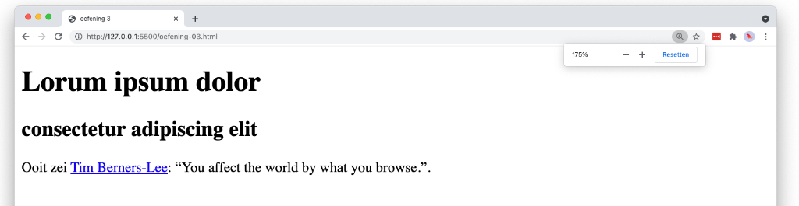

# 💻 01. HTML - basis > oefening 05

## 🛠️ opdrachten

### `index.html` maken

- [ ] Maak een nieuw bestand genaamd `index.html` aan in deze map.
- [ ] Open het bestand.

### voorbeeld namaken

- [ ] Maak het volgende voorbeeld na met behulp van HTML. Gebruik hiervoor minstens de elementen `title`, `h1`, `h2`, `p`, `q` en `a`.
  - De url verwijst naar naar https://www.brainyquote.com/quotes/tim_bernerslee_100459

