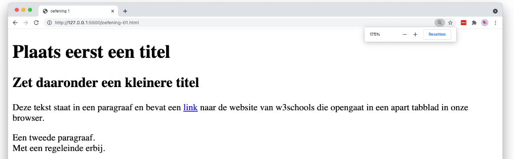

# 💻 LES: W1 - HTML basis - Oefening 09

## 🛠️ Opdrachten

### `index.html` maken

 - [ ] Maak een nieuw bestand genaamd `index.html` aan in deze map.
 - [ ] Open het bestand.

### Voorbeeld Namaken

 - [ ] Maak het volgende voorbeeld na met behulp van HTML. Bedenk zelf welke elementen het meest geschikt zijn voor elk onderdeel.
    - **Tip!** Gebruik websites als [w3schools](https://www.w3schools.com) of [MDN](https://developer.mozilla.org/en-US/docs/Web/HTML) om weinig bekende elementen op te zoeken. Uiteraard kan Google ook altijd helpen!

